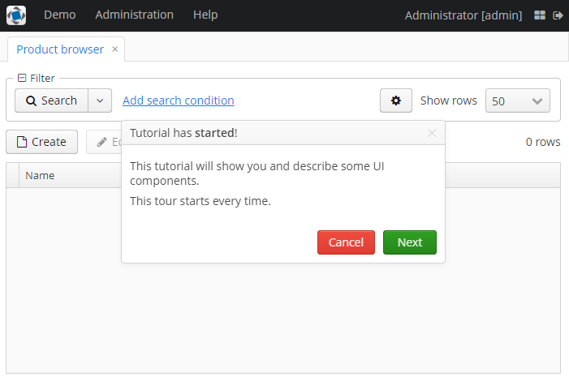
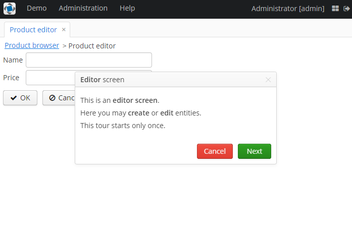

### Preface
Этот аддон предоставляет возможность создавать product tour для экранов в приложениях
[CUBA platform](https://www.cuba-platform.com).

### Main features
Компоненты, используемые для создания и запуска тура:
- **Tour** (A tour consisting of one or multiple steps)
- **Step** (A single step of a tour)
- **StepButton** (A button of a step that can be used to provide different actions if clicked)
- **TourStartAction** (Standard action to start a tour)
- **TourParser** (Parser of Tour objects)

### Usage
Select a version of the add-on which is compatible with the platform version used in your project:

| Platform Version| Add-on Version|
|:----------------|:--------------|
| 6.9.x           | 1.0.0         |


Add custom application component to your project (change the version part if needed):
```
com.haulmont.addon.tour:tour-global:1.0.0   
```

### Description
Этот аддон содержит набор компонентов, позволяющих создавать product tour по пользовательским экранам. 

Создаётся компонент тур. С помощью метода `addStep` к туру можно привязать шаги. Для взаимодействия между шагами тура 
с помощью метода `addStepButton` можно привязать к шагам кнопки. Действия для кнопок можно использовать готовые из
`TourActionType` и `StepActionType` или собственные.

Для тура используется интерфейс `Tour`, для шагов - `Step`, для кнопок - `StepButton`.

Также создать тур можно при помощи `TourParser` вызовом метода `parseTour`, который на вход принимает json, 
messagesPack и window to extend.

Запуск тура осуществляется вызовом действия `TourStartAction`. Задать, будет ли тур запускаться каждый раз при переходе
на экран или только при первом переходе, можно с помощью метода `setSettingsEnabled`.

### Quick start
To use this add-on in a CUBA Studio project, in the project properties add add-on like custom application component and
save settings.
```
com.haulmont.addon.tour:tour-global:1.0.0   
```

#### Sample task
Давайте попробуем создать небольшое приложение, содержащее два экрана с турами.

В этом приложении мы реализуем следующие возможности:
- создание туров на экранах приложения
- задание разных опций для шагов тура
- задание параметра запуска туров

#### Step-by-step guide
Create a new CUBA project and add the given add-on to it.


In the DATA MODEL tab create a new entity "Product" with two attributes.


Create entity browser and entity editor screens via Generic UI screen.

Мы добавим кнопку для запуска тура в `ProductBrowse`, а также реализуем запуск туров при открытии экранов.

Для создания кнопки добавьте следующий компонент к `buttonsPanel` в `product-browse.xml`:

```xml
<button id="tourButton"
        caption="Tutorial" 
        invoke="startTour"/>
```

При инициализации страницы `ProductBrowse` мы будем парсить тур из json файла, который лежит в одной папке с экранами.
В этом json файле описан массив шагов для тура. Для каждого шага описан ряд параметров, а также массив кнопок. 
Для каждой кнопки описаны её атрибуты и действие, которое вызывается при нажатии.

productBrowseTour.json:
```JSON
[
  {
    "id": "step1",
    "text": "tour.tutorialStartedText",
    "title": "tour.tutorialStartedTitle",
    "width": "400",
    "textContentMode": "html",
    "titleContentMode": "html",
    "cancellable": "true",
    "buttons": [
      {
        "caption": "tour.cancel",
        "style": "danger",
        "action": "tour:cancel",
        "enabled": "true"
      },
      {
        "caption": "tour.next",
        "style": "friendly",
        "action": "tour:next",
        "enabled": "true"
      }
    ]
  },
  {
    "id": "step2",
    "text": "tour.createButtonText",
    "title": "tour.createButtonTitle",
    "width": "400",
    "textContentMode": "html",
    "titleContentMode": "html",
    "attachTo": "createBtn",
    "anchor": "right",
    "buttons": [
      {
        "caption": "tour.back",
        "style": "primary",
        "action": "tour:back",
        "enabled": "true"
      },
      {
        "caption": "tour.next",
        "style": "friendly",
        "action": "tour:next",
        "enabled": "true"
      }
    ]
  },
  {
    "id": "step3",
    "text": "tour.editButtonText",
    "title": "tour.editButtonTitle",
    "width": "400",
    "textContentMode": "html",
    "titleContentMode": "html",
    "attachTo": "editBtn",
    "anchor": "right",
    "buttons": [
      {
        "caption": "tour.back",
        "style": "primary",
        "action": "tour:back",
        "enabled": "true"
      },
      {
        "caption": "tour.next",
        "style": "friendly",
        "action": "tour:next",
        "enabled": "true"
      }
    ]
  },
  {
    "id": "step4",
    "text": "tour.removeButtonText",
    "title": "tour.removeButtonTitle",
    "width": "400",
    "textContentMode": "html",
    "titleContentMode": "html",
    "attachTo": "removeBtn",
    "anchor": "bottom",
    "buttons": [
      {
        "caption": "tour.back",
        "style": "primary",
        "action": "tour:back",
        "enabled": "true"
      },
      {
        "caption": "tour.next",
        "style": "friendly",
        "action": "tour:next",
        "enabled": "true"
      }
    ]
  },
  {
    "id": "step5",
    "text": "tour.filterPanelText",
    "title": "tour.filterPanelTitle",
    "width": "400",
    "textContentMode": "html",
    "titleContentMode": "html",
    "attachTo": "filter",
    "anchor": "bottom",
    "modal": "true",
    "buttons": [
      {
        "caption": "tour.back",
        "style": "primary",
        "action": "tour:back",
        "enabled": "true"
      },
      {
        "caption": "tour.finish",
        "style": "friendly",
        "action": "tour:next",
        "enabled": "true"
      }
    ]
  }
]
```

ProductBrowse.java:
```Java
@Inject
protected Resources resources;

@Inject
protected TourParser tourParser;

protected Tour tour;

@Override
public void init(Map<String, Object> params) {
    super.init(params);

    createTour();
}

protected void createTour() {
    String sourceFolder = "com/company/touraddondemo/web/product/";
    String file = resources.getResourceAsString(sourceFolder + "productBrowseTour.json");
    tour = tourParser.parseTour(file, getMessagesPack(), this);
}
```

Далее напишем метод создания действия для запуска тура. Отключим настройки, задающие запуск тура только при первом 
переходе на экран.

```Java
public void startTour() {
    TourStartAction tourStartAction = TourStartAction.create(tour);
    tourStartAction.setSettingsEnabled(false);
    tourStartAction.actionPerform(this);
}
```

Этот метод будет вызываться при нажатии кнопки `tourButton`. Также добавим вызов этого метода при инициализации экрана.

В `ProductEdit` при инициализации будем вызывать метод `createTour()`, в котором создадим объект тура, добавим к нему 
шаги, зададим для них параметры и кнопки:

```Java
protected void createTour() {
    tour = new WebTour(this);

    Step step = new WebStep("step1");
    step.setText(getMessage("tour.editStartedText"));
    step.setTitle(getMessage("tour.editStartedTitle"));
    step.setWidth("400");
    step.setTextContentMode(Step.ContentMode.HTML);
    step.setTitleContentMode(Step.ContentMode.HTML);
    step.setCancellable(true);

    StepButton stepButton = new WebStepButton(getMessage("tour.cancel"));
    stepButton.setStyleName("danger");
    stepButton.setEnabled(true);
    stepButton.addStepButtonClickListener(TourActionType.CANCEL::execute);
    step.addButton(stepButton);

    stepButton = new WebStepButton(getMessage("tour.next"));
    stepButton.setStyleName("friendly");
    stepButton.setEnabled(true);
    stepButton.addStepButtonClickListener(TourActionType.NEXT::execute);
    step.addButton(stepButton);

    tour.addStep(step);

    step = new WebStep("step2");
    step.setText(getMessage("tour.fieldGroupText"));
    step.setTitle(getMessage("tour.fieldGroupTitle"));
    step.setWidth("400");
    step.setTextContentMode(Step.ContentMode.HTML);
    step.setTitleContentMode(Step.ContentMode.HTML);
    step.setAttachedTo(ComponentsHelper.findComponent(getFrame(), "fieldGroup"));
    step.setAnchor(Step.StepAnchor.RIGHT);

    stepButton = new WebStepButton(getMessage("tour.back"));
    stepButton.setStyleName("primary");
    stepButton.setEnabled(true);
    stepButton.addStepButtonClickListener(TourActionType.BACK::execute);
    step.addButton(stepButton);

    stepButton = new WebStepButton(getMessage("tour.next"));
    stepButton.setStyleName("friendly");
    stepButton.setEnabled(true);
    stepButton.addStepButtonClickListener(TourActionType.NEXT::execute);
    step.addButton(stepButton);

    tour.addStep(step);

    step = new WebStep("step3");
    step.setText(getMessage("tour.windowActionsText"));
    step.setTitle(getMessage("tour.windowActionsTitle"));
    step.setWidth("400");
    step.setTextContentMode(Step.ContentMode.HTML);
    step.setTitleContentMode(Step.ContentMode.HTML);
    step.setAttachedTo(ComponentsHelper.findComponent(getFrame(), "windowClose"));
    step.setAnchor(Step.StepAnchor.RIGHT);

    stepButton = new WebStepButton(getMessage("tour.back"));
    stepButton.setStyleName("primary");
    stepButton.setEnabled(true);
    stepButton.addStepButtonClickListener(TourActionType.BACK::execute);
    step.addButton(stepButton);

    stepButton = new WebStepButton(getMessage("tour.finish"));
    stepButton.setStyleName("friendly");
    stepButton.setEnabled(true);
    stepButton.addStepButtonClickListener(TourActionType.NEXT::execute);
    step.addButton(stepButton);

    tour.addStep(step);
}
```
Также в методе инициализации создадим действие для запуска тура без отключения дополнительных настроек.

Для отображения локализованных сообщений необходимо добавить их в `messages.properties`:

```properties
tour.createButtonText = <p>This is a <b>create button</b>.</p> \
  <p>Press the button to open an editor screen to <b>create</b> a new entity.</p>
tour.editButtonText = <p>This is an <b>edit button</b>.</p> \
  <p>Select an entity and press the button to open an editor screen to <b>edit</b> the entity.</p>
tour.removeButtonText = <p>This is a <b>remove button</b>.</p> \
  <p>Select an entity and press the button to remove the entity.</p>
tour.filterPanelText = <p>This is a <b>filter panel</b>.</p> \
  <p>You may choose conditions to filter entities.</p>
tour.fieldGroupText = <p>This is a <b>field group</b> consisting of text fields.</p> \
  <p>You may fill the fields by your own data.</p>
tour.windowActionsText = <p>These are window <b>actions</b>.</p> \
  <p>You are able to <b>confirm</b> or <b>decline</b> changes.</p>
tour.tutorialStartedText = <p>This tutorial will show you and describe some UI components.</p> \
  <p>This tour starts every time.</p>
tour.editStartedText = <p>This is an <b>editor screen</b>.</p> \
  <p>Here you may <b>create</b> or <b>edit</b> entities.</p> \
  <p>This tour starts only once.</p>
tour.editStartedTitle = <b>Editor</b> screen
tour.tutorialStartedTitle = Tutorial has <b>started</b>!
tour.createButtonTitle = <b>Create button</b>
tour.editButtonTitle = <b>Edit button</b>
tour.removeButtonTitle = <b>Remove button</b>
tour.filterPanelTitle = <b>Filter Panel</b>
tour.fieldGroupTitle = <b>Field group</b>
tour.windowActionsTitle = <b>Window actions</b>
tour.back = Back
tour.next = Next
tour.cancel = Cancel
tour.finish = Finish
```

Если мы сейчас запустим приложение, то увидим, что наши новые компоненты отображаются некорректно. CSS классы, 
необходимые для их корректного отображения, ещё не содержатся в нашем проекте.
So we need to create a theme extension in Project Properties.

  

Теперь при переходе на экран `ProductBrowse` каждый раз пользователь будет видеть тур. Также у него будет возможность 
запускать тур нажатием на кнопку с заголовком "Tutorial". При переходе на `ProductEdit` будет запущен тур при первом 
переходе на экран для каждого пользователя.

This is how the ProductBrowse screen looks in the running app:



This is how the ProductEdit screen looks in the running app:


